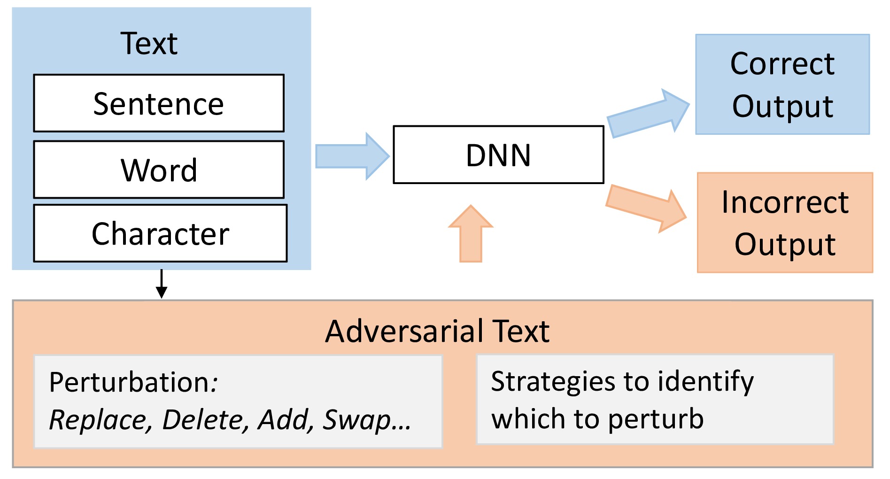

Refereed Conference Proceedings
-----------------------      

|<em>Towards a Deep Learning-driven Service Discovery Framework for the Social Internet of Things: A Context-aware Approach</em>. Abdulwahab Aljubairy, Ahoud Alhazmi, Wei Emma Zhang, and Quan Z. Sheng, Dai Hoang Tran. In Proceedings of the 22nd International Conference on Web Information Systems Engineering (WISE), Melbourne, Australia, October 26-29, 2021. IEEE. |  

|<em>A Fast and Accurate Approach for Inferencing Social Relationships among IoT Objects</em>. Abdulwahab Aljubairy, Ahoud Alhazmi, Wei Emma Zhang, and Quan Z. Sheng, and Dai Hoang Tran. In Proceedings of the International Conference on Advanced Data Mining and Applications (ADMA), Sydney, Australia, Feb 2-4, 2021. pp. 1–7. [Springer](https://link.springer.com/chapter/10.1007/978-3-030-95408-6_7). | 

|<em>A Unified Framework for Improving Misclassifications in Modern Deep Neural Networks for Sentiment Analysis</em>. Ahoud Alhazmi, Abdulwahab Aljubairy, Wei Emma Zhang, and Quan Z. Sheng. In Proceedings of the International Joint Conference on Neural Networks (IJCNN), Virtual Conference, July 18-22, 2021. pp. 1–7. [IEEE](https://ieeexplore.ieee.org/document/9534168). | 

|<em>SIoTPredict: A Framework for Predicting Relationships in the Social Internet of Things</em>. Abdulwahab Aljubairy, Wei Emma Zhang, and Quan Z. Sheng, and Ahoud Alhazmi. In Proceedings of the International Conference on Advanced Information Systems Engineering (CAiSE), Grenoble, France, June 8-12, 2020. pp. 101–116. [Springer](https://link.springer.com/chapter/10.1007/978-3-030-49435-3_7). | 

|<em>Are Modern Deep Learning Models for Sentiment Analysis Brittle? An Examination on Part-of-Speech</em>. Ahoud Alhazmi, Wei Emma Zhang, and Quan Z. Sheng, and Abdulwahab Aljubairy. In Proceedings of the International Joint Conference on Neural Networks (IJCNN), Glasgow, United Kingdom, July 19-24, 2020. pp. 1–7. [IEEE](https://ieeexplore.ieee.org/document/9207665). | 

|<em>Analyzing the Sensitivity of Deep Neural Networks for Sentiment Analysis: A Scoring Approach</em>. Ahoud Alhazmi, Wei Emma Zhang, and Quan Z. Sheng, and Abdulwahab Aljubairy. In Proceedings of the International Joint Conference on Neural Networks (IJCNN), Glasgow, United Kingdom, July 19-24, 2020. pp. 1–7. [IEEE](https://ieeexplore.ieee.org/document/9207078](https://ieeexplore.ieee.org/document/9207000)). | 

|<em>The 10 Research Topics in the Internet of Things</em>. Wei Emma Zhang, and Quan Z. Sheng, Mahmood, A., Dai Hoang Tran, Munazza Zaib, Salma Abdalla Hamad, Abdulwahab Aljubairy, Ahoud Alhazmi, Subhash Sagar. and Congbo Ma. In Proceedings of the 6th International Conference on Collaboration and Internet Computing (CIC), Atlanta, GA, USA, December 1-3, 2020. (pp. 34-43). [IEEE](https://ieeexplore.ieee.org/document/9319033). | 

Refereed Journal Articles
----------------

|<em>Adversarial Attacks on Deep-learning Models in Natural Language Processing: A Survey</em>.Wei Emma Zhang, Quan Z. Sheng, Ahoud Alhazmi, Chenliang Li, 2020.  ACM Transactions on Intelligent Systems and Technology (TIST), pp.1-41. [Springer]([https://link.springer.com/article/10.1007/s00521-020-05667-z](https://dl.acm.org/doi/abs/10.1145/3374217). |  (EiC's Pick as Five Outstanding TIST Articles in Jan 2022, Highly Cited in Semantic Scholar) 

|<em>Memory Management via Ownership Concept Rust and Swift: Experimental Study</em>. Elaf Alhazmi, Abdulwahab Aljubairy, Ahoud Alhazmi, [International Journal of Computer Applications](https://www.ijcaonline.org/archives/volume183/number22/alhazmi-2021-ijca-921572.pdf), 183(22), 2021. |  

|<em>The Impact of Guided Metacognitive Feedback on Novice Programmers Using Learning by Teaching Environment</em>. Ahoud Alhazmi, Rafika Maaroufi and Abdulwahab Aljubairy, Journal of King Abdulaziz University: Computing and Information Technology Sciences 8(2), 2019.| 

